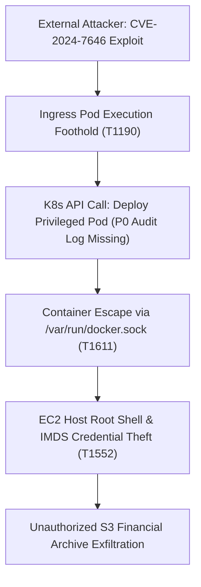

# Chapter 07: P0-P3 Compliance Checklist, Self-Assessment & SIEM Activation

## 1. Statutory Baseline & Multi-Tier Technical Control Matrices

### 1.1 Technical Control Dimensions & Priority Hierarchy
The Container Security Monitoring and Configuration Baseline (MCB for Container) defines an operational verification framework for cloud-native workloads in regulated financial environments. Containerized microservices present ephemeral lifecycles and heterogeneous telemetry across container runtimes, orchestrators, and multi-tenant cloud platforms. To address these operational challenges, the framework enforces three core principles: Cloud Workload Protection Platform (CWPP) prioritization for managed clusters, native security toolchain adoption, and the DeTT&CT (Detect Tactics, Techniques & Combat Threats) evaluation model. This architecture converts complex multi-cloud configuration standards into deterministic verification checklists, enabling security teams to enforce baselines directly and verify telemetry routing from runtime sensors to enterprise SIEM dashboards.

Technical controls are cross-mapped against CIS Docker and Kubernetes Benchmarks, the MITRE ATT&CK for Containers matrix, and cloud provider security architectures. Controls are organized into four mutually non-substitutable priority tiers: Priority 0 (P0) through Priority 3 (P3). Each tier addresses distinct security requirements across the attack and defense lifecycle.

| Priority Tier | Classification Tier Name | Technical Control Positioning | Mandatory Implementation Criteria | Scope & Core Telemetry Feeds |
| :--- | :--- | :--- | :--- | :--- |
| **P0** | Foundational Telemetry & Traceability (Critical) | Baseline operational lifeline for security observability and non-repudiation. | Mandatory deployment gate; pre-launch verification required before production admission. | Kubernetes API server audit logs (`kubernetes:audit`), cloud management audit trails (CloudTrail, Activity Logs), and kernel syscall telemetry via eBPF. |
| **P1** | Threat Defense & Hardening (High) | Active interception perimeter directly mitigating MITRE ATT&CK container TTPs. | Mandatory operational baseline embedded into CI/CD pipelines with high microservice coverage. | Runtime process anomaly detection, network flow telemetry (VPC Flow Logs), and continuous CSPM configuration drift evaluation. |
| **P2** | Environmental Adaptive Defense (Medium) | Adaptive defense-in-depth adjusted to heterogeneous deployment topologies. | Mandatory baseline requiring compensating controls when native platform features are restricted. | Pre-runtime container image vulnerability scanning, image registry access logging, and sensitive cloud object storage protection. |
| **P3** | Operational Observability & Collaboration (Low) | Standard operational telemetry ensuring system availability and incident troubleshooting. | DevOps and Infrastructure baseline collaborative telemetry preventing resource exhaustion. | Compute and memory consumption metrics (CPU, Memory, I/O), container scheduler logs, and controller manager performance data. |

- **P0 (Critical)**: Mandatory deployment gate. Operating without P0 telemetry causes evidence spoliation during incidents, preventing root-cause reconstruction and violating financial non-repudiation mandates.
- **P1 (High)**: Mandatory operational baseline embedded into CI/CD pipelines. Intercepts runtime privilege escalation (`CAP_SYS_ADMIN`), lateral movement, credential access, and policy bypasses.
- **P2 (Medium)**: Contextual defense baseline for heterogeneous platforms. Requires mandatory compensating controls for supply chain and storage layers when native features are restricted.
- **P3 (Low)**: DevOps and SOC operational baseline. Monitors resource consumption and component health to prevent silent denial-of-service and support incident triage.

---

### 1.2 Multi-Cloud Platform Container Security Self-Checklists

The following verification tables define standard checklist items across six enterprise container runtimes and platforms. Each item requires formal verification before production sign-off.

#### Table 91: Docker and Kubernetes Container Security Self-Checklist
| Priority Level | Component / Telemetry Source | Verification Status | Operational Scope & Functional Description |
| :---: | :--- | :---: | :--- |
| **P0** | Kubernetes API Server Logs | [ ] Yes / [ ] No | Administrative requests and REST API calls directed to the control plane. |
| **P0** | Kubernetes Audit Log | [ ] Yes / [ ] No | Request-response payloads, caller identities, and RBAC authorization records. |
| **P0** | Kernel System Call Telemetry (via eBPF) | [ ] Yes / [ ] No | Process executions, socket calls, and namespace shifts at kernel level. |
| **P1** | Containerd Events | [ ] Yes / [ ] No | Container lifecycle transitions (task start, task exit, OOM triggers). |
| **P1** | Containerd Runtime Logs | [ ] Yes / [ ] No | Low-level container execution errors and internal state transitions. |
| **P1** | Docker Events | [ ] Yes / [ ] No | Real-time container state shifts (create, start, kill, destroy). |
| **P1** | Docker Daemon Logs | [ ] Yes / [ ] No | Operational messages, storage driver events, and host communication states. |
| **P1** | Kubernetes Events | [ ] Yes / [ ] No | Pod scheduling decisions, volume attachments, and probe failure events. |
| **P2** | Container Registry Logs | [ ] Yes / [ ] No | Image pull, push, tag modification, and registry authentication records. |
| **P2** | Docker API Logs | [ ] Yes / [ ] No | Client requests submitted to Docker engine REST API endpoints. |
| **P3** | Docker Resource Metrics | [ ] Yes / [ ] No | Container compute, memory, disk I/O, and network interface consumption. |
| **P3** | Kubernetes Controller Manager Logs | [ ] Yes / [ ] No | Control loop synchronization cycles and endpoint slice status updates. |
| **P3** | Kubernetes Scheduler Logs | [ ] Yes / [ ] No | Pod placement algorithms, affinity evaluations, and node filtering records. |

#### Table 92: Amazon Web Services (AWS) Container Security Self-Checklist
| Priority Level | AWS Service & Security Component | Verification Status | Functional Classification & Technical Scope |
| :---: | :--- | :---: | :--- |
| **P0** | Amazon CloudWatch Logs | [ ] Yes / [ ] No | Centralized aggregation target for container and system logs. |
| **P0** | AWS CloudTrail | [ ] Yes / [ ] No | Audit recording of AWS account management API calls. |
| **P0** | Amazon EKS Audit Logs | [ ] Yes / [ ] No | Control plane audit trail capturing Kubernetes API server requests. |
| **P1** | Amazon VPC Flow Logs | [ ] Yes / [ ] No | Network layer IP traffic metadata across worker node interfaces. |
| **P0** | Amazon GuardDuty Foundational | [ ] Yes / [ ] No | Cloud threat detection analyzing DNS, CloudTrail, and flow logs. |
| **P1** | Amazon GuardDuty EKS Protection: EKS Audit Log | [ ] Yes / [ ] No | Threat intelligence analysis of EKS control plane audit logs. |
| **P1** | Amazon GuardDuty Runtime Monitoring (EKS/ECS/EC2) | [ ] Yes / [ ] No | eBPF host security agent monitoring process, file, and network activity. |
| **P2** | Amazon GuardDuty Malware Protection for EC2 | [ ] Yes / [ ] No | Agentless scanning of attached EBS volumes upon suspicious behavior. |
| **P2** | Amazon GuardDuty Malware Protection for S3 | [ ] Yes / [ ] No | Scanning of newly uploaded objects in S3 buckets for malware signatures. |
| **P2** | Amazon GuardDuty S3 Protection | [ ] Yes / [ ] No | Behavioral monitoring of data access patterns against S3 storage. |
| **P2** | Amazon Inspector | [ ] Yes / [ ] No | Automated vulnerability scanning of container images in Amazon ECR. |
| **P1** | AWS Security Hub CSPM | [ ] Yes / [ ] No | Automated compliance checks against CIS AWS and EKS Benchmarks. |
| **P3** | Amazon CloudWatch Container Insights | [ ] Yes / [ ] No | Diagnostic compute, memory, and disk performance metrics. |

#### Table 93: Microsoft Azure Container Security Self-Checklist
| Priority Level | Microsoft Azure Security Component | Verification Status | Functional Classification & Technical Scope |
| :---: | :--- | :---: | :--- |
| **P0** | Azure Activity Log | [ ] Yes / [ ] No | Subscription-level modification events and resource operations. |
| **P0** | Diagnostic Settings | [ ] Yes / [ ] No | Export configuration routing resource logs to Log Analytics. |
| **P1** | Stdout / Stderr Logs | [ ] Yes / [ ] No | Application console output and container runtime error streams. |
| **P0** | Defender for Containers: Runtime Threat Detection | [ ] Yes / [ ] No | DaemonSet sensor analyzing host nodes and container execution. |
| **P0** | Microsoft Entra Privileged Identity Management (PIM) | [ ] Yes / [ ] No | Just-in-time access controls and approval workflows for admin roles. |
| **P0** | Microsoft Entra ID Integration | [ ] Yes / [ ] No | Cloud identity synchronization with Kubernetes native RBAC. |
| **P1** | Microsoft Defender CSPM | [ ] Yes / [ ] No | Agentless discovery, risk scoring, and CIS compliance evaluations. |
| **P1** | Microsoft Defender for Servers (Plan 2) | [ ] Yes / [ ] No | Host-level threat detection, file integrity monitoring, and CVE scans. |
| **P1** | Microsoft Entra Workload ID | [ ] Yes / [ ] No | Federated workload identity eliminating static secret storage. |
| **P2** | Microsoft Defender for APIs | [ ] Yes / [ ] No | Threat detection against API abuse and ingress data leakage. |
| **P2** | Defender for Containers: Vulnerability Assessment | [ ] Yes / [ ] No | Vulnerability scanning of images in Azure Container Registry (ACR). |
| **P2** | Microsoft Defender for Storage | [ ] Yes / [ ] No | Behavioral detection of malware uploads and unauthorized Blob access. |
| **P3** | Azure Monitor Container Insights | [ ] Yes / [ ] No | Performance monitoring for CPU, memory, and node capacity. |
| **P1** | Microsoft Sentinel SIEM Integration | [ ] Yes / [ ] No | Native event ingestion into Sentinel for automated investigation. |
| **P2** | Cross-Cloud Data Ingestion | [ ] Yes / [ ] No | Connectors ingesting multi-cloud telemetry from AWS and GCP. |

#### Table 94: Google Cloud Platform (GCP) Container Security Self-Checklist
| Priority Level | Google Cloud Security Component | Verification Status | Functional Classification & Technical Scope |
| :---: | :--- | :---: | :--- |
| **P0** | Cloud Audit Logs (Admin Activity & Data Access) | [ ] Yes / [ ] No | Immutable audit trails of administrative and data access calls. |
| **P0** | Cloud Logging | [ ] Yes / [ ] No | Centralized log indexer and query platform for GCP telemetry. |
| **P0** | Log Sinks (Router) | [ ] Yes / [ ] No | Export routing filters directing audit logs to external targets. |
| **P1** | GKE Runtime Logs (Stdout / Stderr) | [ ] Yes / [ ] No | Output streams and runtime error logs from workload containers. |
| **P2** | BigQuery Export | [ ] Yes / [ ] No | Long-term analytical storage and forensic query processing. |
| **P0** | Container Threat Detection (CTD) | [ ] Yes / [ ] No | Kernel-level detection of suspicious binaries, escapes, and shells. |
| **P1** | Event Threat Detection (ETD) | [ ] Yes / [ ] No | Stream analysis of Cloud Audit Logs for IAM and privilege anomalies. |
| **P1** | Virtual Machine Threat Detection (VMTD) | [ ] Yes / [ ] No | Hypervisor-level memory scanning detecting rootkits and miners. |
| **P1** | Binary Authorization | [ ] Yes / [ ] No | Deploy-time admission control verifying cryptographic attestations. |
| **P1** | Security Health Analytics (SHA) | [ ] Yes / [ ] No | Automated vulnerability scanning of GKE cluster configurations. |
| **P1** | Google SecOps (Chronicle) Integration | [ ] Yes / [ ] No | Real-time forwarding of GKE audit logs and findings into SecOps. |

#### Table 95: IBM Cloud Container Security Self-Checklist
| Priority Level | IBM Cloud Security Component | Verification Status | Functional Classification & Technical Scope |
| :---: | :--- | :---: | :--- |
| **P0** | IBM Cloud Activity Tracker | [ ] Yes / [ ] No | User and service management action tracking across cloud resources. |
| **P0** | Diagnostic Forwarding Configuration | [ ] Yes / [ ] No | Event streaming to enterprise syslog and storage buckets. |
| **P0** | IBM Log Analysis | [ ] Yes / [ ] No | Operating system and component logging on cluster worker nodes. |
| **P1** | Flow Logs for VPC | [ ] Yes / [ ] No | IP network traffic metadata across VPC container subnets. |
| **P0** | Security Agents (Runtime Sensor) | [ ] Yes / [ ] No | Endpoint agents monitoring system calls and runtime processes. |
| **P1** | SCC Posture Management | [ ] Yes / [ ] No | Continuous compliance verification against CIS and financial baselines. |
| **P2** | Vulnerability Management | [ ] Yes / [ ] No | Vulnerability Advisor scanning images in IBM Container Registry. |
| **P1** | Activity Tracker & Security Agent Correlation | [ ] Yes / [ ] No | Unified correlation of control plane events and agent detections. |
| **P1** | Kubernetes Metadata Enrichment | [ ] Yes / [ ] No | Dynamic attachment of pod, namespace, and node contextual tags. |

#### Table 96: Red Hat OpenShift Container Security Self-Checklist
| Priority Level | Red Hat OpenShift Security Component | Verification Status | Functional Classification & Technical Scope |
| :---: | :--- | :---: | :--- |
| **P0** | ClusterLogForwarder | [ ] Yes / [ ] No | Configurable pipeline forwarding audit and app logs to SIEM. |
| **P0** | OpenShift Audit Logs | [ ] Yes / [ ] No | Control plane audit trail recording OpenShift API requests. |
| **P1** | Application & Node Logs | [ ] Yes / [ ] No | Ingestion of node system journals and container logs. |
| **P0** | RHACS Kubernetes Policy Enforcement | [ ] Yes / [ ] No | Declarative admission control and build-time guardrails for pods. |
| **P0** | RHACS Runtime Security | [ ] Yes / [ ] No | Kernel process monitoring, network profiling, and pod quarantine. |
| **P2** | Quay Automated Vulnerability Scanning | [ ] Yes / [ ] No | Automated static analysis and Clair vulnerability indexing in Quay. |

---

### 1.3 Enterprise SIEM Detection Rule Enablement Matrices

SIEM engines must correlate telemetry from cloud providers, container orchestrators, and runtime agents. The following matrices specify detection rules across five SIEM platforms: Micro Focus ArcSight, Microsoft Sentinel, Splunk Enterprise Security, Google SecOps, and IBM QRadar.

#### Table 97: Micro Focus ArcSight Rule Activation Checklist
| ArcSight Rule Name | Status | Targeted Threat Behavior & MITRE TTP Alignment |
| :--- | :---: | :--- |
| AD Object Permission Enumerated | [ ] Yes / [ ] No | Reconnaissance: AD object permissions inspection (T1069). |
| Audit Cleared Log | [ ] Yes / [ ] No | Defense Evasion: Clearing of system and security logs (T1070.001). |
| AWS Brute Force Activity from EC2 Instance | [ ] Yes / [ ] No | Credential Access: Outbound automated password guessing (T1110). |
| AWS Port Scan | [ ] Yes / [ ] No | Discovery: Network scanning from compromised instances (T1046). |
| AWS Root Account Usage | [ ] Yes / [ ] No | Initial Access: Management actions via root account (T1078.004). |
| Brute Force IDS Detected Attempts | [ ] Yes / [ ] No | Credential Access: Inbound authentication brute-force (T1110). |
| Brute Force OS and Application Attempts | [ ] Yes / [ ] No | Credential Access: Repeated failed logins to hosts (T1110). |
| Chained Rule - Inhibit System Recovery | [ ] Yes / [ ] No | Impact: Destruction of system backup data and recovery states (T1490). |
| Cloud Storage Deleted | [ ] Yes / [ ] No | Impact: Unauthorized deletion of cloud storage buckets (T1485). |
| Consecutive Unsuccessful Logins to Admin Account | [ ] Yes / [ ] No | Credential Access: Password guessing against admin accounts (T1110.001). |
| Consecutive Unsuccessful Logins Multi-Country | [ ] Yes / [ ] No | Credential Access: Geographically impossible travel login failures. |
| Default Account Enabled | [ ] Yes / [ ] No | Persistence: Activation of dormant default admin accounts (T1078.001). |
| Delete Backups Using WBadmin | [ ] Yes / [ ] No | Impact: Invocation of wbadmin to delete local backups (T1490). |
| Detected Directory Traversal | [ ] Yes / [ ] No | Initial Access: Path traversal attacks on web endpoints (T1190). |
| Detected Format String Attack | [ ] Yes / [ ] No | Execution: Format string memory exploits in binaries (T1068). |
| Detected SQL Injection | [ ] Yes / [ ] No | Initial Access: SQL injection attacks against database tiers (T1190). |
| Disable Windows Recovery Using BCDedit Tool | [ ] Yes / [ ] No | Impact: BCDedit manipulation preventing OS recovery (T1490). |
| Egress Restricted Services Passed by Firewall | [ ] Yes / [ ] No | Command and Control: Outbound sessions breaching firewall rules (T1071). |
| Juicy-Rotten-Rogue Potato Exploitation | [ ] Yes / [ ] No | Privilege Escalation: Windows Potato token manipulation (T1068). |
| Malicious Process Masquerading as Windows Process | [ ] Yes / [ ] No | Defense Evasion: Renaming malware to mimic system tasks (T1036.005). |
| Multiple Failed Login to Accounts Single Source | [ ] Yes / [ ] No | Credential Access: Horizontal password spraying attacks (T1110.003). |
| Named Pipe Filename Local Privilege Escalation | [ ] Yes / [ ] No | Privilege Escalation: Insecure named pipe permission abuse (T1068). |
| Privilege Escalation Attempt Detected | [ ] Yes / [ ] No | Privilege Escalation: Generic privilege elevation attempts (T1068). |
| Privilege Escalation through PrintSpoofer | [ ] Yes / [ ] No | Privilege Escalation: Print spooler pipe token impersonation (T1068). |
| Suspicious Network Scanning | [ ] Yes / [ ] No | Discovery: Port reconnaissance across internal cluster subnets (T1046). |

#### Table 98: Microsoft Sentinel Rule Activation Checklist (Domain Synthesis)
| Sentinel Control Domain | Primary Detections & KQL Focus | Targeted MITRE TTPs & Behavioral Focus |
| :--- | :--- | :--- |
| **Cloud Identity & Entra ID Security** | `Attempt to bypass conditional access`, `Bulk Changes to Privileged Permissions`, `Cross-tenant Access Modified`, `Distributed Password cracking in Entra ID`, `Failed logins to Azure Portal`, `MFA Rejected by User`, `MFA Spamming followed by Success`, `Entra ID Role Management Permission Grant`, `NRT PIM Elevation Request Rejected`, `NRT Privileged Role Assigned Outside PIM`, `Password spray against ADFSSignInLogs`, `Sign-ins to disabled accounts`. | Initial Access & Privilege Escalation (T1078.004, T1110.003, T1098). Alerts on credential spraying, MFA fatigue bypass, and privilege grants outside Entra PIM. |
| **Credential Access & Token Theft** | `Detect Potential Kerberoast Activities`, `First access credential added to Service Principal`, `full_access_as_app Granted To App`, `LaZagne Credential Theft`, `LSASS Credential Dumping via Procdump`, `Mail.Read Granted to App`, `Rare application consent`, `Suspicious consent for offline access`, `Consent matching O365 Attack Toolkit/PwnAuth`. | Credential Access & Persistence (T1552.001, T1003.001, T1528). Monitors illicit service principal secret creation, application permissions, and memory credential theft. |
| **Container & Host Runtime Defense** | `Azure RBAC (Elevate Access)`, `Bitsadmin Activity`, `C2-NamedPipe`, `Suspicious Commands by Webserver Processes`, `Software vulnerable to CVE-2023-4863 webp`, `Java Executing cmd to run Powershell`, `Local Admin Group Changes`, `Rare Process as a Service`, `Remote File Creation with PsExec`, `Service Accounts Performing Remote PS`, `Process stopping via taskkill`. | Execution & Privilege Escalation (T1059, T1068, T1609). Flags unexpected shells launched from web services, administrative tool abuse, and binary anomalies on hosts. |
| **Defense Evasion & Malware Activity** | `AV detections: SpringShell Vulnerability`, `AV detections: Tarrask malware`, `Evidence clearing from logs via wevtutil`, `Disabling Security Services via Registry`, `Imminent Ransomware`, `Cobalt Strike Ransomware Activity`, `Qakbot Discovery / Self Deletion`, `SUNBURST / SUPERNOVA / SUNSPOT hashes`, `TEARDROP memory dropper`. | Defense Evasion & Impact (T1070.001, T1562.001, T1486). Identifies security service deactivation, event log tampering, and known malware signatures. |
| **Data Integrity & Storage Security** | `Account Created and Deleted in Short Timeframe`, `Account created/deleted by non-approved user`, `Data deletion on multiple drives via cipher.exe`, `CoreBackUp Deletion Activity`, `Files Copied to USB`, `Shadow Copy Deletions`, `Unusual Volume of file deletion`, `Sign in Failure CA Spikes`. | Impact & Exfiltration (T1485, T1490). Audits anomalous bulk file deletions, shadow copy purging, and rapid account lifecycle manipulation. |

#### Table 99: Splunk Enterprise Security Rule Activation Checklist (Domain Synthesis)
| Splunk Control Domain | Primary Detection Rules & SPL Focus | Targeted MITRE TTPs & Behavioral Focus |
| :--- | :--- | :--- |
| **AWS Telemetry & S3 Data Defense** | `AWS Defense Evasion PutBucketLifecycle`, `AWS Disable Bucket Versioning`, `AWS Bedrock Delete Knowledge Base`, `AWS Bedrock Invoke Model Access Denied`, `AWS Credential Access Failed Login / GetPasswordData`, `AWS High Failed Authentications User/IP`, `AWS IAM Failure/Success Group Deletion`, `AWS SAML Update identity provider`, `Detect AWS Console Login by New User`. | Defense Evasion, Persistence & Credential Access (T1562, T1078.004, T1110). Detects S3 bucket lifecycle tampering, unauthorized IAM policy modifications, and anomalous logins. |
| **Container Engine & Registry Monitoring** | `AWS ECR Container Upload Outside Business Hours`, `AWS ECR Container Upload Unknown User`, `AWS ECR Container Scanning Findings High / Medium / Low`, `ASL AWS ECR Container Upload Anomalies`. | Persistence & Initial Access (T1610, T1525). Monitors anomalous container pushes to Amazon ECR by unvetted accounts or outside operating hours, plus high-severity CVEs. |
| **Kubernetes Orchestration & Secret Defense** | `Kubernetes Abuse of Secret by Location / Agent / Group / User`, `Kubernetes Access Scanning`, `Kubernetes Cron Job Creation`, `Kubernetes Scanning by Unauthenticated IP Address`. | Credential Access & Persistence (T1552.001, T1053.007, T1613). Flags unauthenticated scanning of K8s API servers, rogue CronJob creation, and unauthorized secret access. |
| **Microsoft 365 & Azure AD Audit** | `Azure AD High Risk Sign-in`, `Azure AD Device Code Authentication`, `Azure AD Failed Authentications Spike`, `Azure AD OAuth Application Consent Granted`, `Azure AD Service Principal Owner Added`, `Azure AD User Consent Blocked for Risky App`, `Cloud Provisioning from Novel Location`. | Initial Access & Privilege Escalation (T1078.004, T1098). Alerts on risky sign-ins, anomalous service principal owners, and cloud provisioning from novel locations. |
| **CI/CD Pipeline & DevSecOps Governance** | `GitHub Enterprise Delete Branch Ruleset`, `GitHub Enterprise Disable 2FA Requirement`, `GitHub Enterprise Disable Classic Branch Protection`, `GitHub Enterprise Disable Dependabot / IP Allow List`, `GitHub Enterprise Register Self Hosted Runner / Repo Deleted`, `Risk Rule for Dev Sec Ops by Repository`. | Defense Evasion & Supply Chain Compromise (T1562.001, T1195.002). Identifies unauthorized modifications to code branch protection, disabling 2FA, and rogue runner registrations. |

#### Table 100: Google SecOps (Chronicle) Multi-Cloud Rule Activation Checklist
| Source Ecosystem | Primary Detection Rules Ingested into SecOps | Targeted Threat Behavior & MITRE TTP Focus |
| :--- | :--- | :--- |
| **AWS GuardDuty Ingestion** | Findings for EKS cluster compromise sequence, secret queries, malicious IP callers, anonymous access, kernel module loading, suspicious commands, reverse shells, cryptominers, privileged pods, host path mounts, Docker socket access, runc container escape, and IAM credential exfiltration. | Comprehensive container protection: cluster takeover sequences, pod execution in `kube-system`, container breakout via runc or cgroups, Docker socket mounting, and metadata credential theft. |
| **Microsoft Defender Ingestion** | Alerts for abnormal K8s service accounts, cloud metadata access, kubelet kubeconfig reads, namespace creation from containers, high-privilege commands, miner images, CoreDNS modification, rogue admission webhooks, and penetration testing tools. | Ingestion of Defender alerts: CoreDNS modification, rogue admission webhook creation, namespace escape attempts, and cluster penetration testing tool execution. |
| **Google Cloud SCC (CTD / ETD)** | Alerts for added binary executions, added library loads, private key searches, Ingress Nightmare exploitation, remote copy tool execution, bulk disk deletion, Stratum mining, attack tools, container escapes, and anomalous child shells. | Native Security Command Center alerts: runtime binary tampering, library injection, Stratum mining protocol traffic, container escapes, and anomalous interactive shells. |

#### Table 101: IBM QRadar Container Rule Activation Checklist
| IBM QRadar Rule Name | Status | Targeted Threat Behavior & Operational Scope |
| :--- | :---: | :--- |
| Active Directory Connection Detected | [ ] Yes / [ ] No | Reconnaissance: Anomalous LDAP/Kerberos queries from containers. |
| Attach/Exec Pod | [ ] Yes / [ ] No | Execution: Interactive shell execution via `kubectl exec` (T1609). |
| Brute-force Tool Detected | [ ] Yes / [ ] No | Credential Access: Network brute-force tools executed in pods (T1110). |
| Change memory swap options | [ ] Yes / [ ] No | Defense Evasion: Memory swap configuration modifications. |
| Ingress NGINX Annotation Bypass (CVE-2024-7646) | [ ] Yes / [ ] No | Initial Access: Exploitation of Ingress annotation injection flaws. |
| Clear Log Activities | [ ] Yes / [ ] No | Defense Evasion: Deletion or truncation of container logs (T1070). |
| Container image built on host | [ ] Yes / [ ] No | Persistence: Direct container image builds on worker nodes (T1612). |
| Create Disallowed Namespace | [ ] Yes / [ ] No | Defense Evasion: Provisioning namespaces bypassing policy governance. |
| Create files below /dev | [ ] Yes / [ ] No | Defense Evasion: Writing executable payloads under `/dev` pseudo-paths. |
| Create HostNetwork Pod | [ ] Yes / [ ] No | Privilege Escalation: Workloads configured with `hostNetwork: true`. |
| Create Sensitive Mount Pod | [ ] Yes / [ ] No | Privilege Escalation: Mounting sensitive host paths such as `/etc` (T1611). |
| Full K8s Administrative Access | [ ] Yes / [ ] No | Privilege Escalation: Binding accounts to `cluster-admin` ClusterRole. |
| Host Port Scan Detected | [ ] Yes / [ ] No | Discovery: TCP/UDP port scanning across worker node subnets (T1046). |
| Ingress Object without TLS Certificate Created | [ ] Yes / [ ] No | Baseline: Ingress provisioned without mandatory TLS encryption. |
| K8s CronJob Created/Modified | [ ] Yes / [ ] No | Persistence: Scheduling recurring jobs inside workloads (T1053.007). |
| K8s Event Delete | [ ] Yes / [ ] No | Defense Evasion: Deleting Kubernetes Event objects to hide activity. |
| Kubernetes Dashboard exposed | [ ] Yes / [ ] No | Initial Access: Public exposure of unauthenticated Web Dashboard. |
| Launch Disallowed Container | [ ] Yes / [ ] No | Defense Evasion: Instantiating images from unvetted registries. |
| Launch Suspicious Network Tool in Container | [ ] Yes / [ ] No | Discovery: Network diagnostic tools (`nmap`, `netcat`) run in pods. |
| Suspicious Docker Options | [ ] Yes / [ ] No | Defense Evasion: Launching containers with security-disabling flags. |
| Suspicious Home Directory Creation | [ ] Yes / [ ] No | Persistence: Unauthorized account creation on worker nodes. |
| Suspicious Operations with Firewalls | [ ] Yes / [ ] No | Defense Evasion: Modification of `iptables` rules on container hosts. |
| System user interactive | [ ] Yes / [ ] No | Execution: Interactive sessions initiated under system daemon IDs. |
| Untrusted Node Successfully Joined the Cluster | [ ] Yes / [ ] No | Initial Access: Rogue worker node joining cluster without credentials. |
| Unusual access to bash history file | [ ] Yes / [ ] No | Credential Access: Reading `.bash_history` files across mounts (T1552.001). |

#### Canonical SIEM Detection Rules Matrix
The following core detection rules must be enabled across all enterprise SIEM deployments, defining mandatory query logic, priority tier, and severity:

| Rule ID | Rule Name | Priority Tier | Severity | Target MITRE TTP | Target SIEM Engines | Concrete Detection Query Logic |
| :---: | :--- | :---: | :---: | :---: | :--- | :--- |
| **SIEM-001** | Kubernetes Anonymous User Request | **P0** | High | T1078.004 | Splunk, Sentinel, ArcSight | `verb in ('create', 'update', 'delete', 'patch') AND user.username='system:anonymous'` |
| **SIEM-002** | Privileged Pod Creation Alert | **P1** | Critical | T1611 | Splunk, Sentinel, ArcSight | `requestObject.spec.containers{}.securityContext.privileged=true` |
| **SIEM-003** | Sensitive HostPath Volume Mount | **P1** | Critical | T1611 | Splunk, Sentinel, ArcSight | `requestObject.spec.volumes{}.hostPath.path in ('/', '/etc', '/var/run/docker.sock', '/proc', '/sys')` |
| **SIEM-004** | Interactive Shell in Container Workload | **P1** | Medium | T1059.004 | Splunk, Sentinel, QRadar | `verb='create' AND objectRef.subresource='exec' AND requestObject.command IN ('/bin/sh', '/bin/bash', 'sh', 'bash')` |
| **SIEM-005** | Cryptomining Outbound Connection | **P2** | High | T1496 | Splunk, Sentinel, QRadar | `dest_port IN (3333, 4444, 5555, 7777, 9001) OR dest_domain LIKE '%pool.supportxmr.com%' OR dest_domain LIKE '%stratum%'` |

---

## 2. Production Incident & Remediation Architecture

### 2.1 Incident Context: Compromise of Financial Payment Processing Cluster
A commercial bank migrated its retail clearing services to a multi-tenant Amazon EKS cluster. During staging, engineers deployed an Ingress-NGINX controller to manage incoming traffic. To reduce CloudWatch log ingestion expenses, the team deactivated control plane audit logging, treating it as an optional logging mechanism rather than a mandatory P0 control. Furthermore, runtime security agent deployment (GuardDuty Runtime Monitoring and eBPF daemonsets) was postponed.

An external adversary identified an unpatched Ingress-NGINX controller vulnerable to annotation validation bypass (CVE-2024-7646). By submitting crafted ingress manifests, the adversary executed arbitrary code inside the Ingress pod. Because the default service account had unrestricted API query permissions, the adversary inspected cluster resources and noted that worker nodes lacked Instance Metadata Service Version 2 (IMDSv2) token enforcement.

The adversary deployed a secondary workload configured with `privileged: true` and mounted the host filesystem via `/var/run/docker.sock` (T1611). Using this socket mount, the adversary escaped the container boundary, obtained root access on the EC2 host, and queried the metadata endpoint (`169.254.169.254`) to extract node IAM instance profile credentials. The adversary then accessed internal S3 buckets containing financial transaction archives.

### 2.2 Root-Cause Vulnerability Analysis
The security breach resulted from three systemic configuration defects:
1. **P0 Telemetry Void**: Disabling EKS audit logs created an absolute control plane blindspot. The API requests creating the privileged pod and reading secrets generated zero audit trail records, violating regulatory non-repudiation mandates.
2. **Absence of P1 Admission Control & Runtime Interception**: The cluster lacked validating admission webhooks (OPA Gatekeeper or Kyverno) to block `privileged: true` pods and sensitive hostPath mounts. Without eBPF runtime monitoring, the container breakout executed undetected.
3. **SIEM Field Extraction Failure**: While VPC flow logs were collected, the enterprise SIEM correlation rules lacked normalized field extractors for Kubernetes pod IPs. Outbound metadata requests appeared as legitimate worker node traffic rather than unauthorized pod egress.



### 2.3 Remediation Architecture & Engineering Controls
The bank deployed a three-tier remediation framework to permanently eliminate these vulnerabilities:

#### 1. Mandatory Admission Gatekeeping (Shift-Left Policy Enforcement)
The organization deployed OPA Gatekeeper constraint templates blocking high-risk workload specifications before pods can be scheduled onto worker nodes:
```yaml
apiVersion: constraints.gatekeeper.sh/v1beta1
kind: K8sPSPPrivilegedContainer
metadata:
  name: psp-privileged-container-deny
spec:
  enforcementAction: deny
  match:
    kinds:
      - apiGroups: [""]
        kinds: ["Pod"]
    namespaces:
      - "production-payments"
```
Complementary constraints reject hostPath mounts targeting `/`, `/etc`, `/var/run/docker.sock`, `/proc`, and `/sys`, enforcing CIS Kubernetes Benchmark Section 5.2.

#### 2. P0 Gateway Activation & Immutable Log Pipeline
EKS control plane audit logging was permanently activated in Terraform templates. Log retention was locked to an immutable Amazon S3 bucket with Object Lock compliance mode (1-year retention). Telemetry streams are forwarded in real time through Amazon Kinesis Firehose to the enterprise SIEM.

#### 3. Deterministic SIEM Correlation Rules & Automated Quarantine Playbook
The SOC activated canonical rules SIEM-001 through SIEM-005. When Rule SIEM-002 (Privileged Pod Creation) or SIEM-003 (Sensitive HostPath Mount) fires, an automated SOAR playbook executes:
1. Revokes worker node IAM temporary credentials via AWS STS.
2. Applies a Kubernetes network policy isolating the compromised pod namespace.
3. Cordons and drains the affected worker node for immediate disk forensics.

---

## 3. Scenario Practice & Decision Forensics

### Q1 `[Container Security Architecture - FIRST]`
A cloud security engineer conducts a pre-production compliance assessment for a newly provisioned Kubernetes cluster handling payment transactions. The engineer discovers that while runtime container vulnerability scanning (P2) and container resource metric dashboards (P3) are operational, the Kubernetes API Server audit logging configuration has not been activated due to log storage cost concerns. What is the engineer's FIRST operational course of action?

- A. Authorize production go-live conditionally, provided that runtime vulnerability scanning is scheduled to execute every 12 hours.
- B. Halt the production deployment pipeline immediately and mandate the complete activation and verification of Kubernetes API Server audit logging as a non-negotiable P0 gateway criterion.
- C. Deploy a container network firewall to inspect pod egress traffic as a temporary compensating control for missing control plane logs.
- D. Configure Prometheus and Grafana alerts to monitor worker node CPU and memory saturation metrics as an alternative detection mechanism.

#### Answer & Core Rationale
The correct answer is **B**. Under the MCB for Container baseline, P0 controls serve as the foundational telemetry lifeline and represent mandatory system deployment gateway criteria. Operating without Kubernetes API Server audit logging creates a forensic visibility void and results in evidence spoliation during security incidents, failing regulatory non-repudiation mandates. Deployments must be halted until P0 telemetry is activated.

#### Complete Distractor Forensics
- **Option A is incorrect**: Vulnerability scanning represents a P2 control and cannot substitute for foundational P0 telemetry. Permitting production operation without control plane audit logs leaves administrative actions unrecorded.
- **Option B is correct**: Halting production release is mandatory because P0 telemetry is an absolute prerequisite. In regulated financial systems, non-repudiation and forensic auditability cannot be waived for budgetary reasons.
- **Option C is incorrect**: Network firewalls capture network packet metadata (P1) but cannot inspect Kubernetes API server transactions, RBAC role modifications, or admission requests. It cannot compensate for missing control plane audit trails.
- **Option D is incorrect**: Prometheus metrics belong to P3 (Operational Observability & Collaboration). Resource metrics track compute availability; they provide zero audit visibility into adversary authentication, authorization, or administrative actions.

---

### Q2 `[Threat Detection & Hardening - BEST/MOST]`
During an architectural review of enterprise SIEM detection coverage for an OpenShift and AWS EKS hybrid environment, the SOC team must implement detection logic for container breakout attempts (MITRE ATT&CK T1611: Escape to Host). Which combination of detection rules and telemetry sources provides the BEST detection coverage across both control plane and runtime layers?

- A. Ingest Docker daemon stdout logs into SIEM and search for string occurrences of the word `error` or `failure`.
- B. Enable Rule SIEM-002 and Rule SIEM-003 across Kubernetes audit logs to detect privileged pod specifications and sensitive hostPath mounts, paired with host kernel eBPF telemetry monitoring accesses to `/var/run/docker.sock` and namespace transition system calls.
- C. Configure CloudWatch alarms that trigger when worker node network bandwidth exceeds 80% of provisioned capacity.
- D. Scan all container base images in the enterprise registry weekly using static CVE vulnerability scanners.

#### Answer & Core Rationale
The correct answer is **B**. Container breakout (T1611) involves two distinct phases: deploying an over-privileged pod (control plane phase) and executing host escape payloads (runtime kernel phase). Correlating Kubernetes audit logs (Rules SIEM-002 and SIEM-003) with host kernel eBPF system call telemetry provides comprehensive defense-in-depth, detecting attacks at admission and during runtime execution.

#### Complete Distractor Forensics
- **Option A is incorrect**: Searching stdout logs for generic strings like `error` creates high false-positive volumes and fails to detect stealthy breakout commands that execute without generating application errors.
- **Option B is correct**: This approach correlates control plane admission auditing (`securityContext.privileged=true` and sensitive `hostPath` volumes) with kernel sensor telemetry (`setns`, `unshare`, and docker socket access), delivering optimal detection efficacy.
- **Option C is incorrect**: Bandwidth saturation metrics belong to operational observability (P3). While useful for identifying volumetric DoS attacks, network bandwidth does not indicate whether a container breakout occurred.
- **Option D is incorrect**: Static image scanning is a pre-runtime P2 control identifying known CVEs in libraries. It cannot detect zero-day exploits, misconfigured workload manifests, or runtime breakouts using legitimate tools.

---

### Q3 `[Incident Response & Forensic Recovery - NEXT]`
A financial SOC analyst reviewing Microsoft Sentinel alerts identifies a high-severity alert matching Rule SIEM-001 (`verb in ('create', 'update', 'delete', 'patch') AND user.username='system:anonymous'`) on a production AKS cluster. Initial query results reveal that an unauthenticated caller submitted a `create` request against the `namespaces` API endpoint. What is the incident responder's NEXT operational step?

- A. Immediately restart all worker nodes in the cluster to reset operating system memory.
- B. Validate the authenticity of the alert, isolate the API server network exposure, verify whether the API request succeeded or was denied by RBAC, and inspect authentication logs to identify the ingress vector.
- C. Mark the alert as a false positive, as Kubernetes clusters commonly permit anonymous read and write access for health check probes.
- D. Delete the affected namespace immediately and re-deploy all microservices from the latest git commit.

#### Answer & Core Rationale
The correct answer is **B**. Rule SIEM-001 indicates an attempt by an anonymous identity to perform state-changing administrative operations. In Kubernetes, health probes only execute read verbs against unauthenticated endpoints (such as `/livez` or `/readyz`). State-changing requests (`create`, `update`, `delete`, `patch`) from `system:anonymous` represent severe configuration defects or active adversary probing. The analyst must verify authorization results (200 OK vs 403 Forbidden), restrict API access, and trace the connection source.

#### Complete Distractor Forensics
- **Option A is incorrect**: Restarting worker nodes destroys volatile memory evidence, terminating running processes and invalidating forensic analysis without addressing the underlying API server exposure.
- **Option B is correct**: Determining whether the request succeeded or was rejected establishes whether a breach occurred. Concurrently verifying API server network exposure and identifying the source IP defines the scope of containment.
- **Option C is incorrect**: Kubernetes health checks use HTTP GET requests against health endpoints; they never execute state-changing actions like creating namespaces. Treating anonymous administrative writes as benign false positives is an operational failure.
- **Option D is incorrect**: Deleting namespaces prematurely without forensic preservation destroys attacker artifacts and operational audit trails, while failing to remediate the exposed API server authentication flaw.

---

### Q4 `[Runtime Observability & Admission Governance - PRIMARY/EXCEPT]`
A financial organization operates a regulated container platform and enforces strict compliance with the P0-P3 Container Security Monitoring and Configuration Baseline. All of the following operational practices comply with the mandatory implementation rules of this framework EXCEPT:

- A. Disabling runtime eBPF syscall telemetry (P0) across production clusters to reduce memory overhead, arguing that weekly static image vulnerability scanning (P2) provides sufficient compensating risk coverage.
- B. Implementing automated OPA Gatekeeper admission rules to reject any deployment manifest requesting `hostPath` volume mounts to sensitive directories including `/etc` and `/var/run/docker.sock`.
- C. Configuring bi-directional event forwarding from AWS GuardDuty and Microsoft Defender for Cloud into an enterprise SIEM for unified cross-cloud threat correlation.
- D. Establishing continuous monitoring dashboards for CPU and memory usage (P3) to distinguish between operational capacity spikes and cryptomining activity.

#### Answer & Core Rationale
The correct answer is **A**. Under the MCB for Container baseline hierarchy, P0 controls (foundational telemetry including eBPF syscall monitoring and audit logs) are mandatory gateway criteria that cannot be disabled or substituted by lower-tier controls. P2 controls (image vulnerability scanning) provide pre-runtime static analysis and cannot compensate for missing runtime behavioral visibility. Claiming that static scans replace runtime telemetry violates the framework.

#### Complete Distractor Forensics
- **Option A is the exception (correct answer)**: P0 controls represent non-negotiable operational baselines. Lower-priority tiers (P2) cannot serve as compensating controls for missing foundational telemetry. Disabling eBPF syscall monitoring eliminates visibility into active host escapes and in-memory execution.
- **Option B is compliant**: Enforcing admission control policies to block dangerous hostPath mounts is a core requirement of P1 threat defense and directly addresses MITRE ATT&CK technique T1611.
- **Option C is compliant**: Cross-cloud event forwarding into an enterprise SIEM is standard operational practice under P1/P2 SIEM integration, aligning with the multi-cloud checklists for Sentinel, Splunk, and SecOps.
- **Option D is compliant**: Applying P3 resource metrics in conjunction with security alerts to differentiate legitimate workload spikes from unauthorized cryptomining (T1496) represents the intended collaborative function of operational observability.
